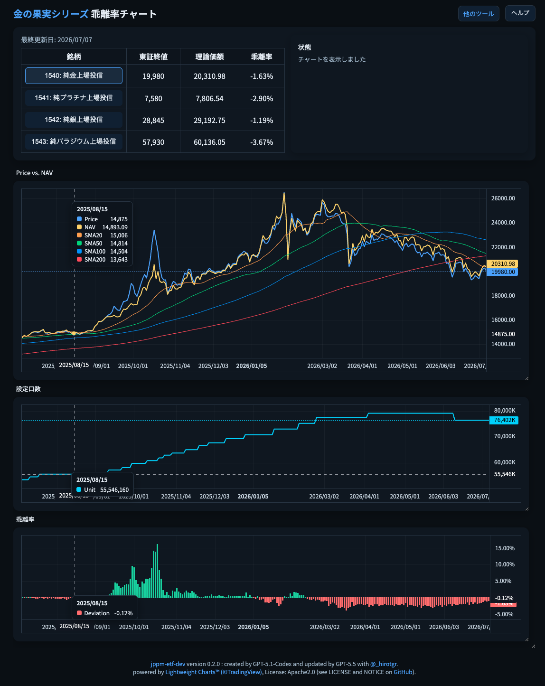

三菱UFJ信託銀行＋三菱UFJ AMによる国内現物保管型貴金属ETF (1540.T, 1541.T, 1542.T, 1543.T) の市場価格(東証終値/Price) vs. 理論価額(基準価額/NAV)、設定口数、乖離率を描画するツールです。

Webページ(`index.html`)右上の`ヘルプ`も参照してください。 
GitHub Pages: https://hirotgr.github.io/jppm-etf-dev/

- - -

* `./jppm-etf-dev/index.html` : 本体
  * ローカルに保存して実行する場合は、`index.hml` を `jppm-etf-dev.html` などに名前を変更して保存し、ブラウザで開いてください。
* `./jppm-etf-dev/jppm-etf-dev.obf` : obfuscated data
* `./jppm-etf-dev-data-update.sh` (内部でPython実行) : データ更新スクリプト例 (*)
* `./jppm-etf-dev-obf-verify.py`, `./jppm-etf-dev-obfuscate.py` : obfuscation処理
* `com.[username].jppm-etf-dev-data-update.plist` : macOSでの定時実行 plist例  (*)
  * `~/Library/LaunchAgents/`　に置いて `launchctl [load | unload] ~/Library/LaunchAgents/com.[username].jppm-etf-dev-data-update.plist` および `launchctl list com.[username].jppm-etf-dev-data-update`
* `implementation.md` : 実装の概要説明

 
(*) : 環境に応じてカスタマイズが必要

  

使用イメージ

* テーブル: 市場価格(東証終値/Price)、基準価額(理論価額/NAV)、乖離率のデーブル
* 上段チャート: 市場価格(東証終値/Price)、基準価額(理論価額/NAV)、SMA
* 中段チャート: ETFの総口数 → 運用会社による設定と解約の状況が分かる
* 下段チャート: 乖離率 (Price vs. NAV)

